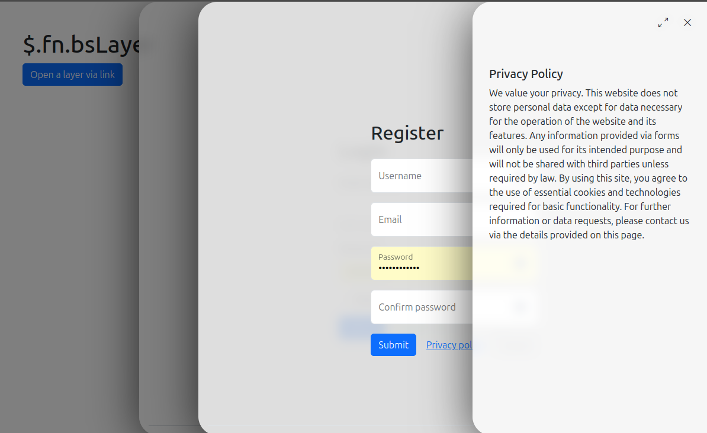

# bs-layerSlideMenu

A lightweight sliding layer (off-canvas menu & modal) system for jQuery and Bootstrap 5.  
Supports stacking multiple layers, custom AJAX content, animation, and full keyboard support.


---

## Features

- Stackable sliding layers (like modals, but multi-level)
- Smooth open/close animations
- AJAX content loading support
- Close all layers with a single call, stacked "top-down"
- Callback support for all key events
- Full Bootstrap 5 compatibility
- Easily extensible with custom logic

---

## Installation

Install with Composer (Bootstrap 5, Bootstrap-Icons & jQuery must be present):

```
composer require twbs/bootstrap twbs/bootstrap-icons components/jquery
```

**Or include JS/CSS manually:**

```html
<link href="vendor/twbs/bootstrap-icons/font/bootstrap-icons.min.css" rel="stylesheet">
<link rel="stylesheet" href="vendor/twbs/bootstrap/dist/css/bootstrap.min.css">


<script src="vendor/components/jquery/jquery.min.js"></script>
<script src="vendor/twbs/bootstrap/dist/js/bootstrap.bundle.min.js"></script>
<script src="dist/bs-layer.js"></script>
```

---

## Getting Started

**HTML Example:**

```html
<a data-bs-toggle="layer" data-url="login.html" href="#slide_menu" class="btn btn-primary">
    Open a layer via link
</a>
```

**JavaScript Usage:**

```javascript
// Initialize a layer trigger
$('[data-bs-toggle="layer"]').bsLayer({
    // url: 'login.html',
    onLoad: function($content) {
        // Callback after content loaded
    }
});
```

---

## API

### Open a Layer

```javascript
$('[data-bs-toggle="layer"]').bsLayer({ url: 'login.html' });
```

### Closing Layers

#### Close Top Layer

```javascript
$.bsLayer.close();
```

#### Close All Layers (Animated, from topmost downwards)

```javascript
$.bsLayer.closeAll();
```

- **All layers will close one after another, with their animation, until none are left.**

---

## Configuration

All configs and defaults via `$.bsLayer.config` and `$.bsLayer.defaults`:

<details>
<summary>Click for config reference</summary>

```js
// -------------------
// Global Config (technical/internal settings, rarely changed by users)
// -------------------
const layerConfig = {
    ajax: {
        method: 'GET', // Default HTTP method for AJAX requests
        contentType: 'application/x-www-form-urlencoded; charset=UTF-8' // Default content type for AJAX
    },
    distanceBetweenLayers: 100,         // Offset in px between stacked layers
    animationDuration: 400,             // Show/hide animation duration in ms
    zIndexStart: 1050,                  // Initial z-index for the first layer
    parent: 'body',                     // Parent element where layers are appended
    icons: {
        close: 'bi bi-x-lg',            // Bootstrap Icon for close
        maximize: 'bi bi-arrows-angle-expand', // Bootstrap Icon for maximize
        minimize: 'bi bi-arrows-angle-contract', // Bootstrap Icon for minimize
    },
    onError($message) {
        // Global error handler for layer actions
    }
};

// -------------------
// Default Options (typical layer settings, can be customized for each usage)
// -------------------
const layerDefaults = {
    name: 'layer01',                    // Unique name/id for the layer instance
    title: null,                        // Optional: layer title (string or HTML)
    width: undefined,                   // Custom width, e.g. '600px' or a number
    backdrop: true,                     // Show backdrop: true (default), false, or 'static' (not closable by click)
    url: null,                          // URL to load content via AJAX
    closeable: true,                    // Show a close (X) button in the header
    expandable: true,                   // Allow the layer to be maximized
    queryParams(params) {               // Function to process parameters for AJAX requests
        return params;
    },
    onAll: function(eventName, ...args) {},     // Callback for every fired event
    onPostBody: function($content) {},          // Called after content is loaded
    onShow: function() {},                // Called before layer is shown
    onShown: function() {},               // Called after layer is fully visible
    onHide: function() {},                      // Called before layer hides
    onHidden: function() {},                    // Called after layer is hidden
    onRefresh: function($content) {},           // Called when layer content is refreshed
    onCustomEvent: function(eventName, ...params) {} // For custom user events
};
```
</details>

---

## License

Proprietary  
See [composer.json](composer.json) for author information.# bs-layerSlideMenu
